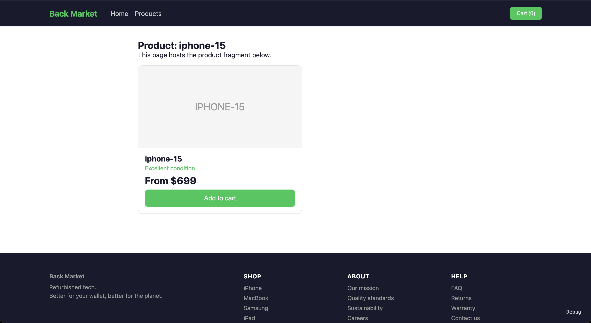
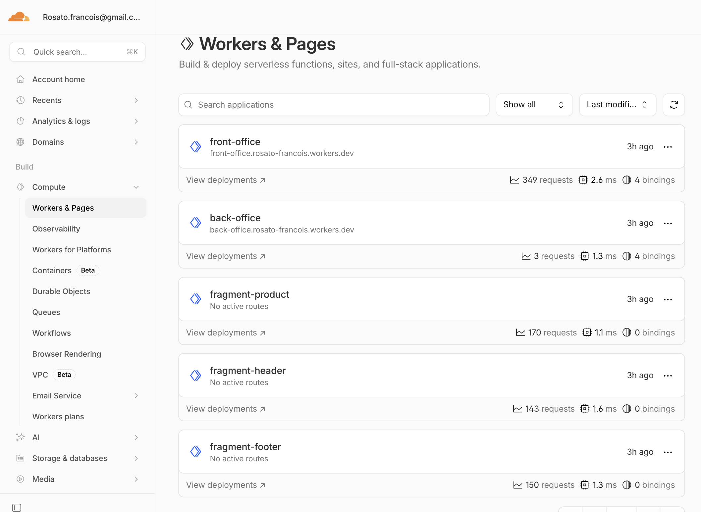

# Meta Framework POC

Vue micro-frontend architecture on Cloudflare Workers. Each team owns a "fragment" — an independently deployed Worker that SSR-renders a piece of the page. A shell Worker stitches fragments at the edge, streams HTML, and hydrates into a single SPA client-side.

Goal: prove Back Market can decompose the frontend into independently deployable micro-frontends without sacrificing SSR perf or DX.

URL: <https://front-office.rosato-francois.workers.dev/>

## Framework Documentation

See [framework/documentation/README.md](framework/documentation/README.md) for full docs.

## Get started

> cd monorepo

> pnpm install

> pnpm run preview:front-office
