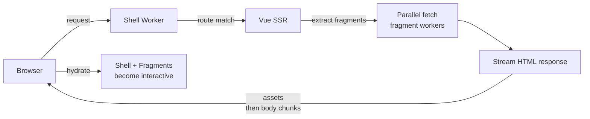

# Getting Started

## Prerequisites

- Node.js 22+ (pinned via Volta in `monorepo/package.json`)
- pnpm 10+
- Cloudflare account (for deploy)

## Monorepo Structure

```
monorepo/
  packages/
    apps/
      front-office/          # Shell worker — owns the page
      back-office/           # Another shell worker
    fragments/
      fragment-header/       # Independent micro-frontend
      fragment-footer/
      fragment-product/
  pnpm-workspace.yaml
  package.json
framework/                   # The framework package (linked as workspace dep)
```

## Create a Shell App

Minimal files for a new app at `monorepo/packages/apps/my-app/`:

```
my-app/
  application.config.ts      # defineApplicationConfig()
  vite.config.ts             # defineShellConfig()
  wrangler.jsonc             # Cloudflare Worker config
  src/
    router.ts                # Route definitions
    layouts/default.vue      # Default layout with <slot> + <Fragment>
    pages/index.vue          # Page component
    middleware/               # Optional middleware
```

**`vite.config.ts`**
```ts
import { defineShellConfig } from 'framework/vite';
export default defineShellConfig();
```

**`application.config.ts`**
```ts
import { defineApplicationConfig } from 'framework/config';
export default defineApplicationConfig({
  document: { title: 'My App', viewTransitions: true },
});
```

**`src/router.ts`**
```ts
import type { AppRoute } from 'framework';
import IndexPage from './pages/index.vue';

export const routes: AppRoute[] = [
  { path: '/', component: IndexPage, layout: 'default' },
];
```

**`src/layouts/default.vue`**
```vue
<template>
  <Fragment id="header" />
  <main><slot /></main>
  <Fragment id="footer" />
</template>

<script setup lang="ts">
import { Fragment } from 'framework';
</script>
```

## Create a Fragment

Minimal files at `monorepo/packages/fragments/fragment-hello/`:

```
fragment-hello/
  fragment.config.ts         # defineFragmentConfig()
  vite.config.ts             # defineFragmentConfig() (Vite)
  wrangler.jsonc
  src/
    App.vue                  # Root component
```

**`vite.config.ts`**
```ts
import { defineFragmentConfig } from 'framework/vite';
export default defineFragmentConfig();
```

**`fragment.config.ts`**
```ts
import { defineFragmentConfig } from 'framework/config';
export default defineFragmentConfig({
  cache: 'public, max-age=3600',
});
```

**`src/App.vue`**
```vue
<template>
  <div class="hello">Hello from fragment!</div>
</template>
```

## Dev / Preview / Deploy

From `monorepo/`:

```bash
pnpm install            # Install all deps
pnpm run build          # Build all packages (fragments first, then apps)
pnpm run preview        # Build + wrangler dev on :8787
pnpm run deploy:all     # Build + deploy all workers to Cloudflare
```

## Request Lifecycle (Simplified)



1. Browser hits the shell worker
2. Shell matches the route, runs middleware, SSR-renders the layout + page
3. `<Fragment>` placeholders are extracted from the rendered HTML
4. All fragment workers are fetched in parallel via service bindings
5. HTML streams back: shell assets flush first, then body segments with fragment content in document order
6. Browser hydrates shell and each fragment independently
