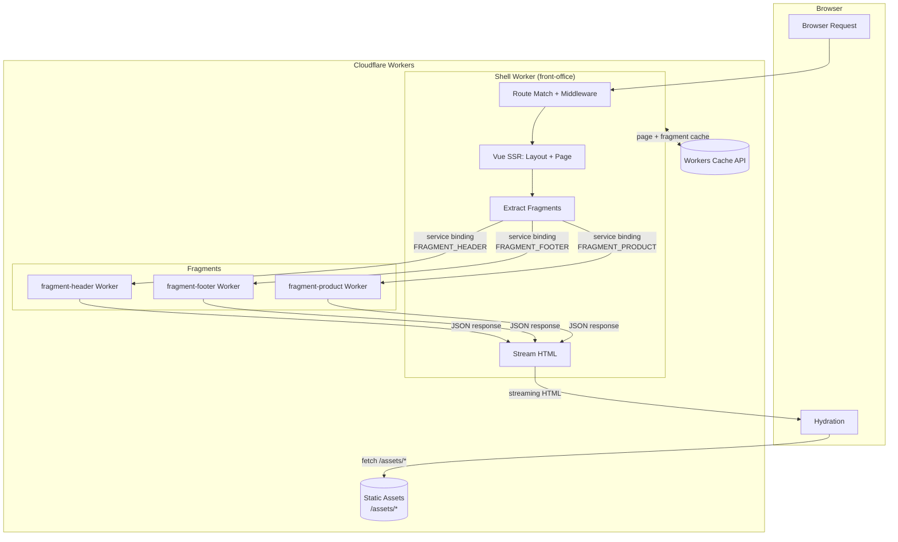

# Architecture Overview

## Design Principles

1. **Deploy independence** — each fragment is a standalone Worker, deployable without coordinating with other teams
2. **Edge performance** — SSR on Cloudflare Workers, streaming HTML, parallel fragment fetches
3. **Org scaling** — teams own fragments end-to-end; shell team owns page structure
4. **Incremental migration** — adopt one fragment at a time; mix legacy and new

## Key Abstraction

- **Shell** owns the HTML page: document skeleton, route matching, layout, asset tags, hydration orchestration
- **Fragments** own components: independent SSR, independent state, independent deploy
- **No shared SSR state** — fragments communicate client-side only (DOM events pub-sub)
- **Vue is shared** — single Vue runtime loaded once via import map, externalized from all fragment client builds

## System Architecture



## Import Map / Shared Vue

Vue is loaded once via an import map in `<head>`:

```html
<script type="importmap">{"imports":{"vue":"/assets/vue.a1b2c3d4.js"}}</script>
```

- Shell's client build emits `vue.[hash].js` via `vueBrowserBundlePlugin()` — the pre-built `vue.runtime.esm-browser.prod.js`
- All fragment client builds use `external: ['vue']` so they `import` from the import map
- Result: one copy of Vue shared across shell + all fragments

## Dev vs Production

| Aspect | Dev (`pnpm dev`) | Production (`pnpm preview` / deploy) |
|--------|------------------|--------------------------------------|
| SSR | Vite dev server | Cloudflare Worker |
| Fragment fetch | Direct function call | Service binding (Worker-to-Worker) |
| Assets | Vite dev server serves | `env.ASSETS` binding (Cloudflare static) |
| Cache | No caching | Workers Cache API (page + fragment) |
| Vue bundle | Vite resolves | Import map → hashed asset |
| Debug bar | Always available | Cookie-gated |
