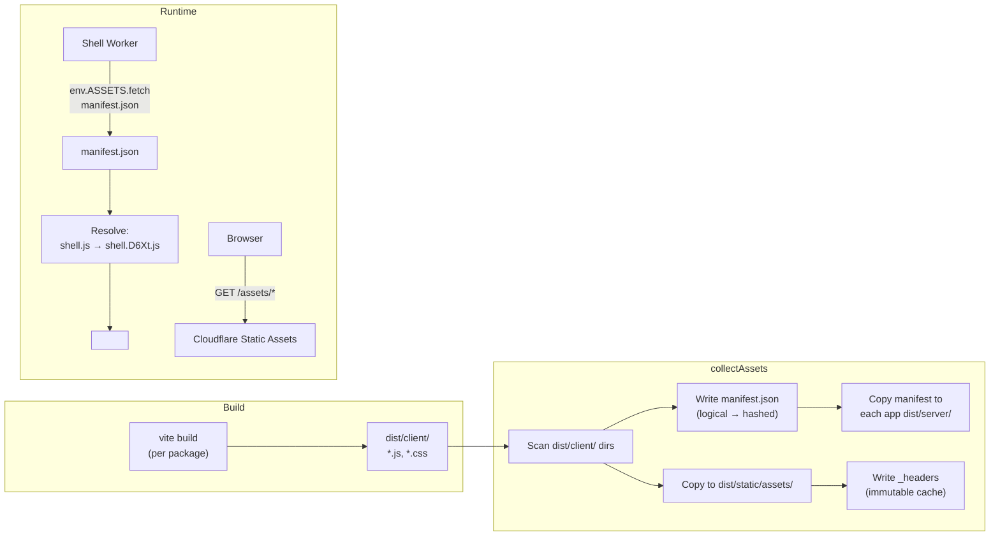

# Build & Assets

Source: `framework/src/collect-assets.ts`

## Build Order

1. `pnpm -r run build` — builds all packages (pnpm respects dep order: fragments before apps)
2. Each package runs: `vite build && vite build --mode client`
3. `collectAssets()` — runs during `framework-cli preview` and `framework-cli deploy`

## `collectAssets()` Walkthrough

```ts
function collectAssets(root: string)
```

1. **Discover workers**: `discoverWorkers(root)` finds all fragments + apps
2. **Clean**: `rm -rf dist/static`
3. **Create target**: `mkdir dist/static/assets/`
4. **For each worker**:
   - Read `dist/client/.vite/manifest.json` (Vite build manifest)
   - Extract logical names by stripping 8-char hashes: `shell.D6XthhtI.js` → `shell.js`
   - Record mappings in `mergedManifest`
   - Copy all files from `dist/client/` to `dist/static/assets/` (skip `.vite/` dir)
5. **Detect Vue bundle**: find `vue.[hash].js` in assets (not in Vite manifest since it's a raw emitted asset)
6. **Write `manifest.json`**: merged manifest into `dist/static/assets/`
7. **Copy manifest to apps**: write into each app's `dist/server/` so the worker can read it at runtime
8. **Write `_headers`**: Cloudflare static asset cache headers

## Manifest Shape

```json
{
  "shell.js": "shell.D6XthhtI.js",
  "shell.css": "shell.BqYZ2kFo.css",
  "vue.js": "vue.a1b2c3d4.js",
  "fragment-header.js": "fragment-header.DbLCPfZE.js",
  "fragment-header.css": "fragment-header.D6XthhtI.css",
  "fragment-footer.js": "fragment-footer.X7mKp2qR.js",
  "fragment-footer.css": "fragment-footer.Y8nLq3rS.css"
}
```

Keys are logical names, values are hashed filenames. At runtime, `buildShellTags()` and `buildFragmentHeadTags()` resolve logical → hashed.

## `_headers` File

```
/assets/*
  Cache-Control: public, max-age=31536000, immutable
```

Cloudflare serves static assets with immutable caching — safe because filenames are content-hashed.

## Runtime Asset Resolution

In `createShellWorker()` (`framework/src/worker/shell.ts`):

```ts
if (!manifest && (env as any).ASSETS) {
  const res = await (env as any).ASSETS.fetch(new Request('https://dummy/assets/manifest.json'));
  if (res.ok) manifest = await res.json();
}
```

The manifest is lazy-loaded once from the `ASSETS` binding (Cloudflare static assets). All subsequent requests use the cached manifest.

## Asset Flow


