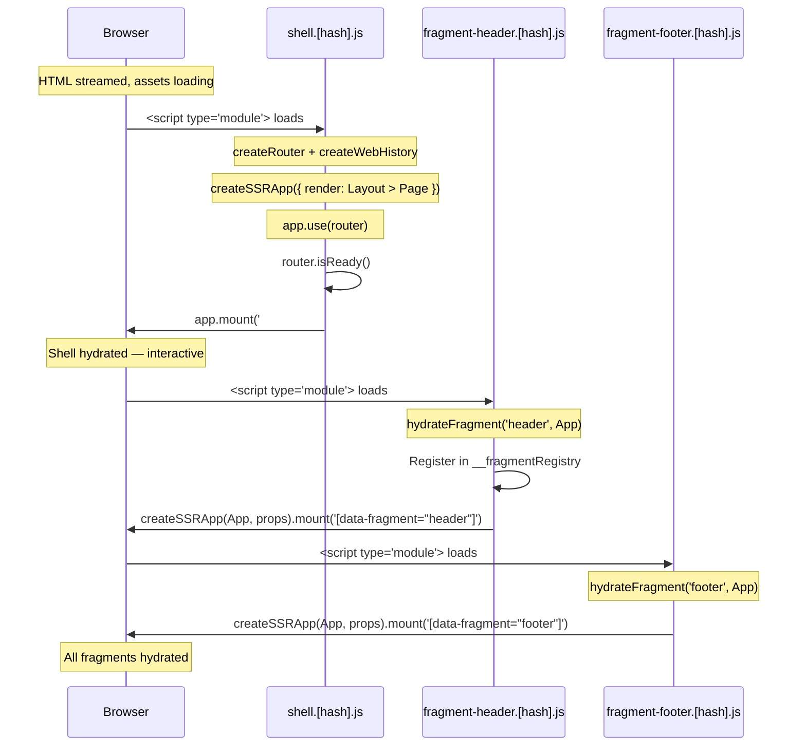
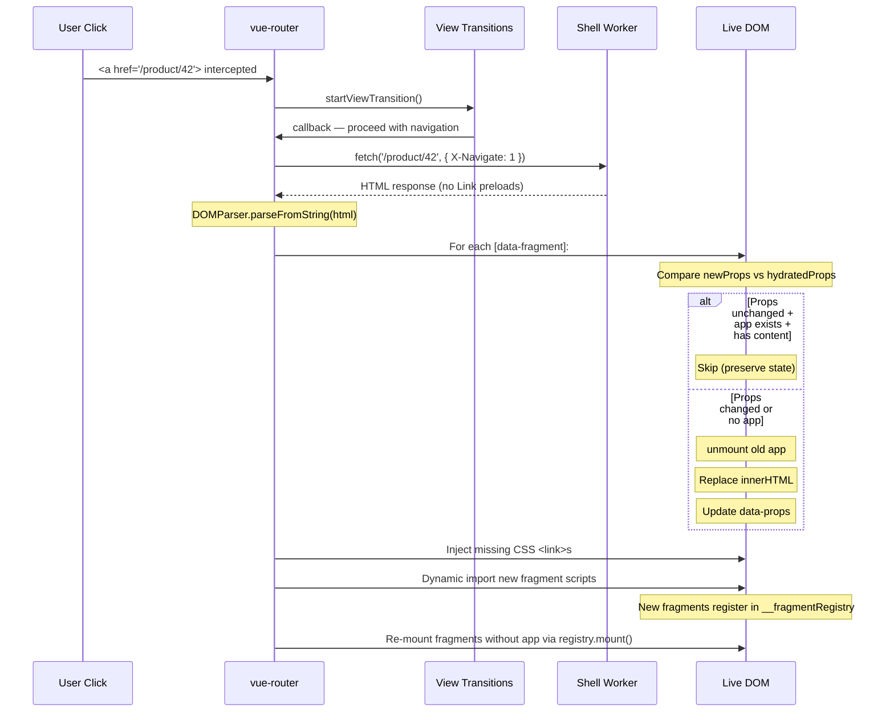

# Hydration & Navigation

Source: `framework/src/hydration/shell.ts`, `framework/src/hydration/fragment.ts`

## Hydration Sequence



### Shell Hydration (`hydrateShell`)

1. Convert `AppRoute[]` → vue-router `RouteRecordRaw[]` via `toClientRoutes()`
2. Create `vue-router` with `createWebHistory()`
3. `createSSRApp` renders: resolve current route → get Layout → render Layout with Page as slot
4. `app.use(router)` then `router.isReady()` then `app.mount('#app')`
5. Sets up link interception + SPA nav handlers

### Fragment Hydration (`hydrateFragment`)

1. Register entry in `globalThis.__fragmentRegistry`:
   ```ts
   { mount: (container) => mountFragment(...), app: null, hydratedProps: '' }
   ```
2. Find `[data-fragment="${id}"]` in DOM
3. Parse `data-props` attribute as JSON
4. `createSSRApp(App, props).mount(container)` — SSR hydration (matches server HTML)
5. Store `app` instance and `hydratedProps` in registry

## SPA Navigation Flow



### SPA Nav Details

1. **Link interception**: `document.addEventListener('click')` catches `<a href="/...">` clicks, calls `router.push(href)`
2. **View Transitions**: `router.beforeEach` wraps navigation in `document.startViewTransition()` (if enabled and supported)
3. **Fetch new page**: `fetch(to.fullPath, { headers: { 'X-Navigate': '1' } })` — the `X-Navigate` header tells the shell to skip `Link` preload headers
4. **Parse HTML**: `new DOMParser().parseFromString(html, 'text/html')`
5. **Diff fragments**: for each `[data-fragment]` in live DOM:
   - If new props === old `hydratedProps` AND app exists AND content not empty → **skip** (preserves client state like cart count)
   - Otherwise → unmount old app, replace innerHTML, update `data-props`
6. **Inject CSS**: any `<link rel="stylesheet">` in new HTML not in current `<head>` → append
7. **Load scripts**: for fragment scripts in new HTML whose fragment isn't in registry → `import(src)`
8. **Re-mount**: for fragments with no `app` → call `registry[id].mount(el)`

## `createSSRApp` vs `createApp`

| Context | Function | Why |
|---------|----------|-----|
| Initial hydration (shell + fragments) | `createSSRApp` | Matches server-rendered HTML, attaches event listeners |
| SPA nav re-mount | `createApp` | No server HTML to match — fresh render into empty container |

In `mountFragment()` (`framework/src/hydration/fragment.ts:20`):
```ts
const app = ssr ? createSSRApp(App, props) : createApp(App, props);
```

## Stale Navigation Protection

A `navId` counter increments on each navigation. After async operations (fetch, import), the handler checks `currentNav !== navId` and aborts if a newer navigation started. This prevents race conditions from rapid clicking.

## `__fragmentRegistry` Shape

```ts
// globalThis.__fragmentRegistry
Record<string, {
  mount: (container: Element) => void;  // Re-mount function (uses createApp, not createSSRApp)
  app: App | null;                       // Current Vue app instance (null after unmount)
  hydratedProps: string;                 // JSON string of last-hydrated props (for diffing)
}>
```

Lifecycle:
1. Fragment script loads → registers entry with `mount` function, `app: null`
2. Initial hydration → `app` set, `hydratedProps` set
3. SPA nav (props changed) → `app.unmount()`, `app = null` → `mount()` called → new `app` set
4. SPA nav (props unchanged) → skipped entirely
