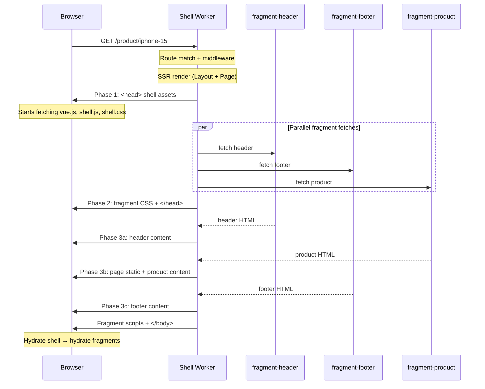

# SSR Rendering Pipeline

Core implementation: `framework/src/request-handler.ts`

## `handleRequest()` — 5-Step Flow

### 1. Route Match + Middleware

```ts
const route = matchRoute(config.routes, url.pathname);
if (!route) return new Response('Not Found', { status: 404 });

const middlewareResponse = await runMiddleware(config.middlewareRegistry, route.middleware, request);
if (middlewareResponse) return middlewareResponse;
```

Routes are pre-compiled to `RouteEntry[]` with regex patterns. Middleware chain short-circuits on first `Response`.

### 2. SSR Render Layout + Page

```ts
const comp = typeof route.component === 'function' && !(route.component as any).__vccOpts
  ? (await (route.component as () => Promise<{ default: Component }>)()).default
  : route.component as Component;

const app = createSSRApp({
  render: () => h(Layout, null, { default: () => h(comp, route.props) }),
});
const appHtml = await renderToString(app);
```

Lazy components (`LazyComponent`) are resolved here. The SSR renders Layout wrapping Page. `<Fragment>` components render as `<div data-fragment="..." data-props="...">` placeholders.

### 3. Extract Fragments + Parallel Fetch

```ts
const fragments = extractFragments(appHtml);
const fragmentPromises = Object.fromEntries(
  fragments.map((f) => [f.id, fetchFragment(f.id, request, { ...route.props, ...f.props })])
);
```

`extractFragments()` uses regex to find `data-fragment="..."` + `data-props="..."` in the rendered HTML. All fragment fetches fire in parallel.

### 4. Three-Phase Streaming

The response streams in three phases:

**Phase 1 — Shell assets flush** (immediate):
```html
<!DOCTYPE html>
<html><head>
  <link rel="stylesheet" href="/assets/shell.[hash].css">
  <link rel="modulepreload" href="/assets/vue.[hash].js">
  <script type="importmap">...</script>
  <script type="module" src="/assets/shell.[hash].js"></script>
```

Browser starts fetching Vue, shell JS, and shell CSS immediately — before SSR even finishes.

**Phase 2 — Fragment CSS + close head:**
```html
  <link rel="stylesheet" href="/assets/fragment-header.[hash].css">
  <link rel="stylesheet" href="/assets/fragment-footer.[hash].css">
</head><body><div id="app">
```

Fragment CSS stays in `<head>` to prevent FOUC.

**Phase 3 — Body segments with fragments in document order:**

```ts
for (const seg of segments) {
  if (seg.type === 'static') {
    await writer.write(encoder.encode(seg.html));
  } else {
    const result = await fragmentPromises[seg.id];
    // write fragment HTML inline
  }
}
```

Static HTML flushes immediately. Fragment segments await their parallel fetch promise. Fragment `<script>` tags are collected and emitted after `</div id="app">` to avoid hydration mismatch.

### 5. Response Headers

```ts
if (!isClientNav) headers['Link'] = linkHeaders.join(', ');  // preload hints
if (route.cache) headers['Cache-Control'] = route.cache;
```

`X-Navigate: 1` header on SPA nav requests → skip `Link` preload headers (browser already has the assets).

## Streaming Timeline



## Asset Tag Builders

| Function | Output | Location |
|----------|--------|----------|
| `buildShellTags(manifest)` | Shell CSS link, Vue modulepreload, import map, shell JS | `<head>` (Phase 1) |
| `buildFragmentHeadTags(ids, manifest)` | Fragment CSS links | `<head>` (Phase 2) |
| `buildFragmentBodyTag(id, manifest)` | Fragment JS `<script type="module">` | After `</div id="app">` |

All resolve logical names (e.g. `shell.js`) to hashed filenames via the asset manifest.
